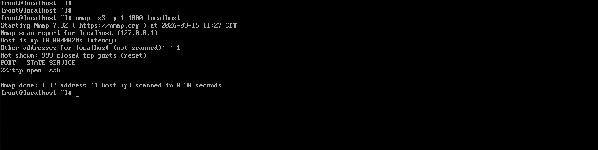
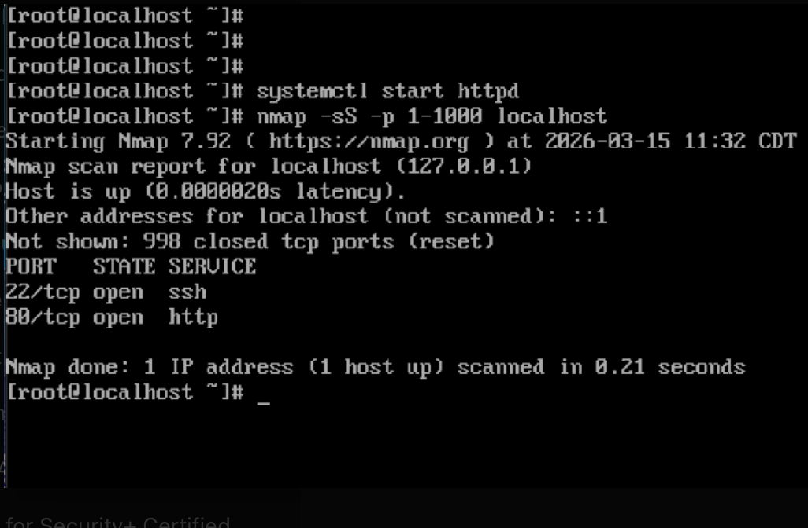
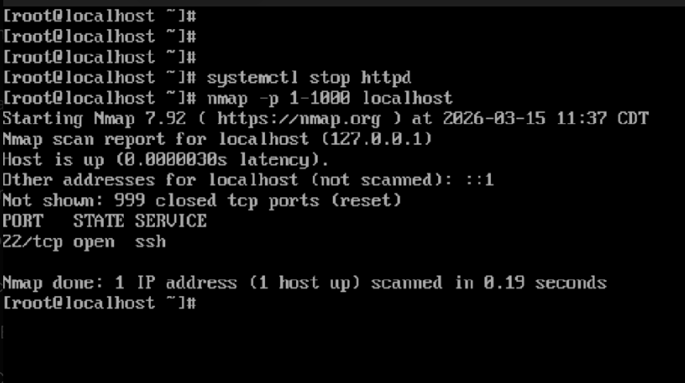
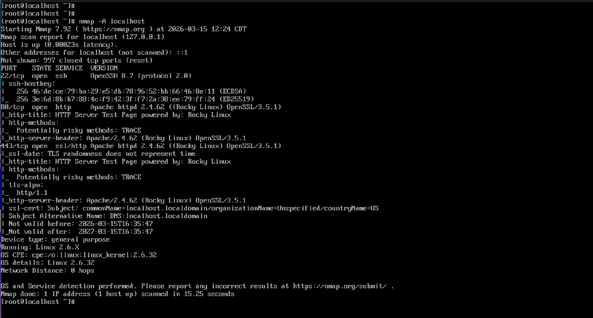

# Nmap Network Scanning and Service Enumeration Lab

## Overview

This project demonstrates how network services affect open ports and how Nmap can be used to identify and analyze them. The lab was conducted on a Linux system, focusing on port scanning, service management, and basic security analysis.

## Tools Used

* Nmap
* Rocky Linux
* Apache HTTP Server (httpd)

## Objectives

* Identify open ports on a system
* Understand how services map to ports
* Observe how starting and stopping services affects port states
* Perform service and version detection using Nmap

## Methodology

### Baseline Scan

A scan was performed before starting any additional services.

```bash
nmap -sS -p 1-1000 localhost
```

Result:

* Port 22 (SSH) open
* All other ports closed



---

### Starting HTTP Service

The Apache web server was started to observe changes in open ports.

```bash
systemctl start httpd
```

Scan performed:

```bash
nmap -sS -p 1-1000 localhost
```

Result:

* Port 22 (SSH) open
* Port 80 (HTTP) open



---

### Stopping HTTP Service

The Apache service was stopped to observe port changes.

```bash
 systemctl stop httpd
```

Scan performed:

```bash
nmap -sS -p 1-1000 localhost
```

Result:

* Port 80 closed
* Only port 22 remained open



---

### Aggressive Scan (Service Enumeration)

An aggressive scan was performed to gather detailed information about services and the system.

```bash
nmap -A localhost
```

Findings:

* OpenSSH detected on port 22
* Apache httpd detected on port 80
* HTTP server headers exposed
* Potentially risky HTTP method detected: TRACE



---

## Key Findings

* Open ports correspond to active services
* Starting services increases system exposure
* Stopping services reduces attack surface
* Nmap can identify service versions and system details

## Security Insight

The aggressive scan identified the HTTP TRACE method as enabled, which may introduce security risks such as Cross-Site Tracing (XST) if not properly restricted.

## Conclusion

This lab demonstrates practical understanding of network scanning, Linux service management, and port-to-service relationships. It highlights how system configuration directly impacts network exposure and security posture.

## Author

Akere Simaze
